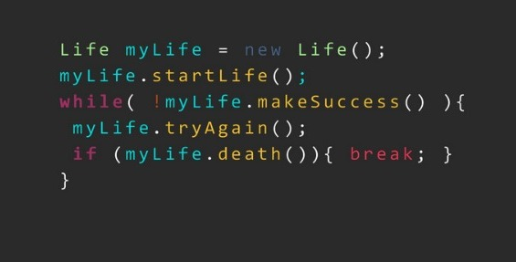

# Hello guys

My name is Vanessa Bertoldo and I currently work with full-stack development with a focus on backend using tools such as Node.js, React and Laravel. Furthermore, I started my studies in mobile development, where I use Android Studio, using the Java and Kotlin languages.

## Additional Information
<ul>
  <li><b>Age:</b> 20 years</li>
  <li><b>University: </b>FIAP</li>
  <li><b>Course:</b> Systems development and analysis</li>
</ul>

## Skills

 
  
  
  
  
  
  
  
   
  
           

--- 
# 📊 GitHub Stats:

  <a href="https://github.com/Vanessa-Bertoldo">
 
  

--- 

# Contact

  
  

